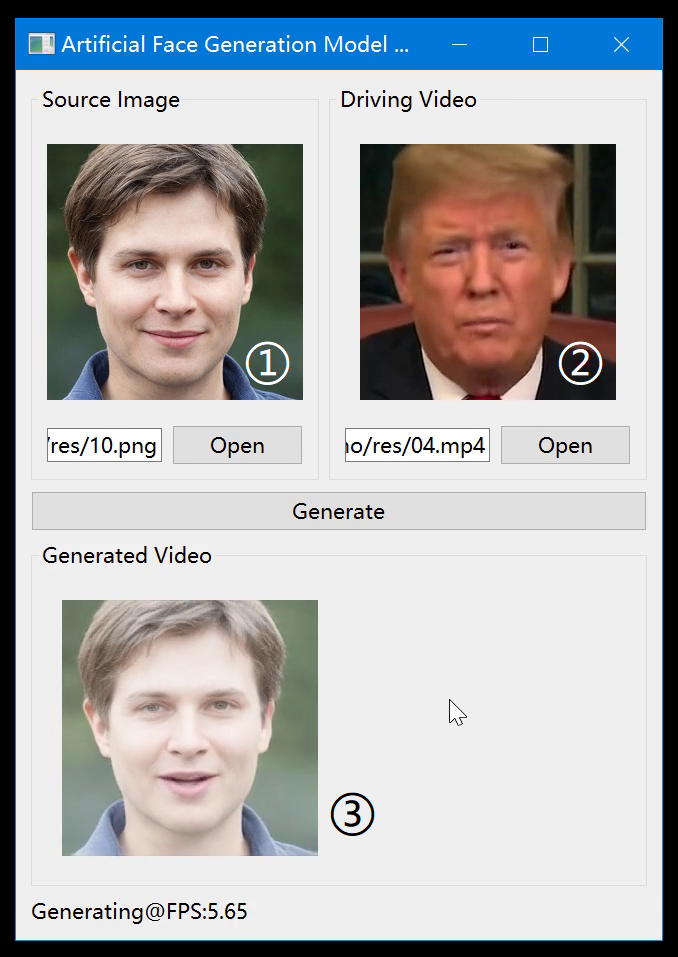

### Get Started
1. Install requiremnts

2. Put pretrained model file in "./res" folder
pre-trained model:  https://drive.google.com/drive/folders/1Gs6_sMEyu2bhTeHxUpRiODYc5HWsWe5s?usp=sharing

3. Run demo_gui.py

4. Function Introduction

    ① - source image, which provides the face feature.
    
    ② - driving video, which controls the expression of the face in the source image.
    
    ③ - generated video.
    
    
